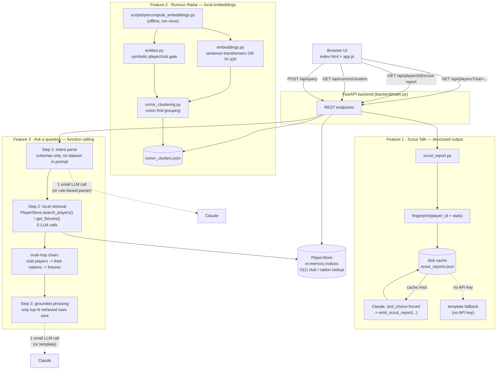

# Dual Kit

**One player. Two shirts. Every stat.**

Pick a club — Arsenal, Manchester City — and see the current squad cross-referenced
against the national team each player is on duty for at the World Cup. Flip the
switch and go the other way: pick a country and see which clubs its starters and
bench players actually turn out for week to week.

It started as a small, specific problem: my boyfriend supports Manchester City and
we have to watch the World Cup matches separated due to work. He'll message "watch this one, it's
got three of my players in it" — this is the tool that answers that question without
him having to tell me. It grew into a demonstration of three ways to use an LLM
*pragmatically* in a small app: structured output instead of prose-parsing, local
embeddings instead of a per-call API, and function calling instead of naive RAG.

## What it does

- **Club → Country view.** Pick Arsenal or Manchester City, see the full squad,
  and see which national team (and role — starter or bench) each player is on
  duty for right now.
- **Country → Club view.** Flip the lens switch, pick England or Switzerland (or
  any of the 26 national teams in the sample data), and see which clubs across
  Europe its players actually come from.
- **Jersey badges, the other way round.** Every card shows a small generated
  jersey badge in the *other* team's real kit colors — club colors when you're
  browsing a national squad, national colors when you're browsing a club squad
  — so the visual always reinforces "this player has two shirts." Procedurally
  drawn SVG, not photos: no licensing to worry about, nothing that can break or
  404. Goalkeepers get a long-sleeve silhouette. Goalkeeper kits use a
  separate, researched color table (real GK kits are never the outfield home
  color) — see "Goalkeeper kit research" below for exactly what's confirmed
  vs. placeholder.
- **Scout Talk** — a 2-sentence, structured scouting note per player, generated
  on demand.
- **Transfer Rumour Radar** — messy, duplicate transfer rumours grouped by
  meaning, not by exact wording.
- **Ask a question** — a plain-English search bar ("Which Man City players are
  playing this weekend?") answered by a small function-calling pipeline.

## Data note

Player ⇄ club ⇄ national-team ⇄ role mappings reflect real, publicly reported
call-ups for the 2026 FIFA World Cup as of early July 2026 — that part is real
and is the actual point of the app. **Every numeric stat (goals, assists,
ratings, market values, caps) is a seeded-random placeholder** generated by
`scripts/build_sample_data.py` — there's no free, reliable live football-stats
API to pull exact current numbers from in this environment. Will swap in a real
provider (api-football.com, football-data.org, Opta, etc.) by implementing the
same interface as `PlayerStore` in `backend/data_store.py` later; nothing else in the
app needs to change.

### Goalkeeper kit research

Goalkeeper jersey colors (`frontend/app.js`, `GK_KIT_COLORS`) are researched
separately from outfield home colors, since keepers essentially never wear
the same color as their team's outfield home kit. Only entries actually
confirmed by real 2025-26 club or 2026 World Cup kit-launch coverage are
marked `confirmed: true`; every other team falls back to a visually distinct
`PLACEHOLDER_GK_KIT` (charcoal/grey, dashed border in the UI, honest tooltip)
rather than a guessed color. Confirmed so far:

| Team | GK kit | Source |
|---|---|---|
| Arsenal | Light yellow / red (adidas Tiro 25) | Arsenal.com, Goal.com kit-launch coverage |
| Manchester City | Vivid green base, orange/pink panels (Puma) | mancity.com official kit launch |
| England | Deep "Astronomy Blue" with lion graphic (Nike) | Footy Headlines, Goal.com 2026 WC kit coverage |
| France | Black / bronze, Statue of Liberty graphic (Nike) | Footy Headlines 2026 WC GK kit roundup |
| Brazil | Green with white logos (Nike, bespoke) | Footy Headlines 2026 WC GK kit roundup |

Everything else — the other ~20 clubs and ~15 nations in the sample dataset —
uses the honest placeholder. Extending this table is mechanical (add an entry
to `GK_KIT_COLORS` with a source comment); it just needs more research time
than this pass covered, since most smaller clubs don't have well-covered
bespoke keeper kits the way Premier League clubs and World Cup nations do.

---

## Quickstart

```bash
python -m venv .venv && source .venv/bin/activate   # or your tool of choice
pip install -r requirements.txt

# optional: pip install -r requirements-embeddings.txt for real local
# sentence embeddings instead of the built-in TF-IDF fallback

# optional: export ANTHROPIC_API_KEY=sk-... for live Claude-generated
# scout reports and NL-query parsing (both work without it, see below)

python scripts/build_sample_data.py        # regenerate data/players.json
python scripts/precompute_embeddings.py    # cluster the transfer rumours

uvicorn backend.main:app --reload
# open http://localhost:8000
```

Every AI feature runs with **zero configuration and zero API key** — see
"offline fallbacks" below. Setting `ANTHROPIC_API_KEY` upgrades two of the
three features to live Claude calls without touching any other code.

---

## Architecture



---

## Feature 1 — Scout Talk (structured output)

**Problem:** turning `{goals: 12, assists: 4, rating: 7.3}` into a 2-sentence
scouting note that's actually structured data, not a paragraph you have to
regex apart.

**Approach:** one tool, `emit_scout_report`, with a JSON schema, and
`tool_choice` forced to it. Claude's reply *is* the object — headline,
2-sentence analysis, standout stat — no markdown fences, no "here's your
JSON:" preamble to strip.

**Cost control:** every report is cached on disk, keyed by
`sha256(player_id + goals + assists + apps + rating + wc_goals + wc_assists)`.
Reopen the page five minutes later with unchanged stats → cache hit → **zero
tokens spent.** Only a stat change invalidates the key.

**Offline fallback:** no `ANTHROPIC_API_KEY` → a deterministic templated note
generated from the same stats, clearly labeled `"source": "template"` in the
API response rather than pretending to be model output.

Files: `backend/ai/scout_report.py`, `backend/ai/cache.py`.

## Feature 2 — Transfer Rumour Radar (local embeddings)

**Problem:** "Real Madrid eye Mitoma" / "Mitoma targeted by Los Blancos" are
the same story told twice.

**Approach:** embed every rumour once with a local model
(`sentence-transformers/all-MiniLM-L6-v2` — CPU-friendly, ~80MB, no
per-request API cost), build a cosine-similarity matrix, and group
transitively with union-find (disjoint-set) so A~B~C merge even if A and C
aren't directly similar enough on their own.

**A real failure this surfaced, kept in on purpose:** while building the
zero-dependency TF-IDF fallback (used when `sentence-transformers` isn't
installed), two *unrelated* rumours merged purely because they shared
generic phrasing ("World Cup form", "linked with a move"). Bag-of-words
similarity — and to a lesser extent even real embeddings — can be fooled by
stories that are stylistically similar but about different people. The fix:
`entities.py` extracts which known players/clubs each rumour actually names
and gates the merge on **shared player** first, falling back to shared club
only when no player is detected. That's a small hybrid symbolic + neural
retrieval pattern, and it's the kind of thing you only find by running the
pipeline against real-ish messy text, not by staring at the algorithm.

**Cost control:** clustering runs once, offline, via
`scripts/precompute_embeddings.py` → `data/rumor_clusters.json`. The API
serves that file (an O(1) read) instead of re-embedding on every request.
`rumor_clustering.incremental_update()` handles new rumours arriving later by
embedding only the new ones and comparing against existing cluster
centroids — O(new × clusters), not O(total²).

**Complexity:** the all-pairs similarity matrix is O(n²) — instant for
dozens of rumours, wrong for tens of thousands. At that scale, swap in an
approximate-nearest-neighbour index (FAISS/HNSW) so each new rumour is only
compared against its nearest few hundred candidates; the union-find grouping
logic underneath doesn't change.

Files: `backend/ai/embeddings.py`, `backend/ai/entities.py`,
`backend/ai/rumor_clustering.py`, `scripts/precompute_embeddings.py`.

## Feature 3 — Ask a question (function calling, not naive RAG)

**Problem:** answer "Which Man City players are playing this weekend?" or
"Who is Switzerland's top-scoring defender?" from plain English.

**Why function calling instead of embedding the question and doing
nearest-neighbour search over the roster:** the data is small and already
structured (club, position, goals, dates). Translating the question into
`search_players(club=..., position=...)` is faster, exact, and doesn't have
the "this weekend" problem a vector store has no special handling for
(a date range isn't a semantic-similarity concept). Real RAG-over-embeddings
earns its place for *unstructured* text at scale — that's Feature 2. Same
underlying idea (retrieval before generation), different data shape,
different tool.

**The pipeline, with its cost budget at each step:**

1. **Intent parse** — one small LLM call. The model receives *only* the two
   tool schemas (`search_players`, `get_fixtures`) and the question — never
   the dataset. Input cost is a few hundred tokens flat, regardless of how
   large the roster grows.
2. **Local retrieval** — zero LLM calls. The parsed call runs as a plain
   in-memory filter in `PlayerStore`. A **multi-hop chain** handles compound
   questions like "which of my club's players are playing this weekend":
   find the club's players → collect their national teams → look up
   fixtures for those teams. That chaining decision is a deterministic
   keyword check, not a second paid call.
3. **Grounded phrasing** — one small LLM call, given *only* the top
   `NL_QUERY_MAX_RESULTS_TO_LLM` (default 8) retrieved rows, instructed to
   answer using nothing else. This is the context-window management story:
   token cost is O(results returned), not O(dataset size).

Every response includes the actual numbers, not just the claim:

```json
"context_window_accounting": {
  "naive_full_dataset_tokens_per_call": 15424,
  "actual_tokens_sent_to_model": 177,
  "reduction_pct": 98.9
}
```

(measured on this repo's ~70-player sample dataset — the gap only widens as
the roster grows, since the naive number scales with dataset size and the
actual number doesn't.)

**Offline fallback:** no API key → `_rule_based_parse` (keyword/regex
matching against known club and country names) does step 1, and a plain
f-string template does step 3. Same three-step shape either way.

Files: `backend/ai/nl_query.py`.

---

## Performance notes

| Operation | Complexity | Notes |
|---|---|---|
| Club/nation lookup | O(1) dict access | `PlayerStore` builds indices once at startup |
| Structured search (`search_players`) | O(n) over roster | Fine at hundreds of players; swap for a real index/DB before tens of thousands |
| Scout report | O(1) on cache hit, else 1 LLM call | Disk-cached by stats fingerprint |
| Rumour clustering | O(r²) all-pairs, once, offline | Not per-request; swap to ANN (FAISS/HNSW) past ~10k rumours |
| NL query | 2 small LLM calls (or 0, offline) | Context capped at top-N rows, not full dataset |

## Project structure

```
dualkit/
├── backend/
│   ├── main.py            FastAPI app + routes
│   ├── config.py          env vars, feature flags, per-backend thresholds
│   ├── data_store.py       PlayerStore -- in-memory indices + search_players/get_fixtures
│   └── ai/
│       ├── scout_report.py    Feature 1
│       ├── embeddings.py      local embedding backend (+ TF-IDF fallback)
│       ├── entities.py        symbolic player/club extraction (clustering gate)
│       ├── rumor_clustering.py Feature 2 (union-find grouping)
│       ├── nl_query.py        Feature 3 (function calling / RAG pipeline)
│       └── cache.py           disk cache used by Feature 1
├── data/
│   ├── players.json        generated sample dataset (see build_sample_data.py)
│   ├── transfer_rumors.json
│   ├── fixtures.json
│   └── rumor_clusters.json  precomputed output of Feature 2
├── frontend/
│   ├── index.html / style.css / app.js   vanilla JS, no build step
├── scripts/
│   ├── build_sample_data.py     regenerates data/players.json
│   └── precompute_embeddings.py runs Feature 2's offline batch job
└── requirements.txt / requirements-embeddings.txt
```

## Extending this to production

- **Real stats:** implement a `DataProvider` with the same shape as
  `PlayerStore` backed by a real API or DB; nothing else changes.
- **Real fixtures:** `data/fixtures.json` is a hand-curated handful of
  matches — swap `PlayerStore.get_fixtures` for a real schedule API.
- **Scale the rumour pipeline:** add an ANN index (FAISS/HNSW) once the
  corpus is large enough that O(n²) stops being instant.
- **More tools for Feature 3:** the function-calling pipeline is built to
  take more tools (e.g. `compare_players`, `get_transfer_rumors_for`) the
  same way `get_fixtures` was added alongside `search_players`.
